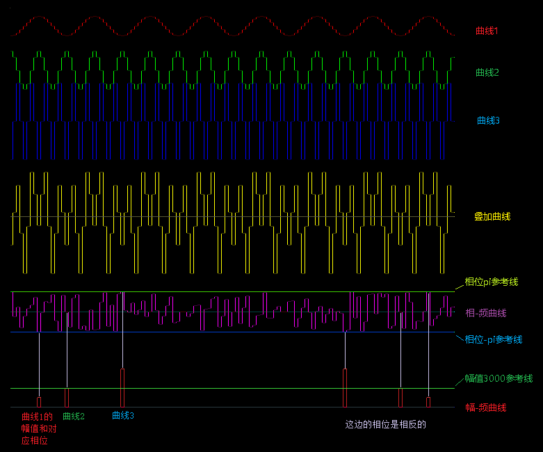

# 编译

* make 生成执行程序  out

# 运行(ubuntu)

* ctrl + alt + F1 进入命令行模式, 再用cd指令回到 out 所在目录

* sudo ./out (打开/dev/fb0设备需要管理员权限)

# 输出相频/幅频图像

* 为方便查看,图像作了横向拉伸

# 输入参数

* 曲线1: cos, 采样频率:16点/周期, 相位:-pi, 幅值: 1500

* 曲线2: cos, 采样频率:8点/周期, 相位:0, 幅值: 3000

* 曲线3: cos, 采样频率:4点/周期, 相位:pi, 幅值: 6000

* 采样点数: 128

# 输出反推输入

* 在main.c中,以数组outPF[N]、outAF[M]的形式输出相频、幅频曲线,其中N为采样点数(上图为128个点);

* 通过幅频曲线可以定位到凸起处在数组中的序号n(n=0,1,2,,,N/2),通过n继而取得目标曲线的**相位**outPF[n]、**幅值**outAF[n];

* 目标曲线的**周期**用公式 **T = N/n*t, (n <= N/2)** 得到,其中t为采样点实际时间间隔.

